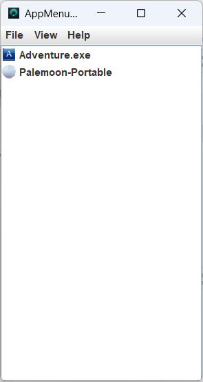

This a implementation of AppMenuLauncher in Windows Forms using Java.
It was created to be a demonstration and for learning purposes of what Java Swing can do in terms of GUI interfaces for Windows.

The implementation was described in the post article [Selecting the best GUI toolkit - part 4: Windows Forms](https://wp.me/paNQgO-5j). This one is the fifth of a series introduced in  [Selecting the best GUI programming toolkit – First part (planning)](https://codehouse.digfish.org/selecting-the-best-widget-toolkit-1/).

## Running

Clone locally the project, and on Intellij IDEA open the folder. There should be several running configurations. You'll have to choose the "Launcher" configuration. 
If you just want to run the app without an IDE, use the `run*` script according to your platform.

